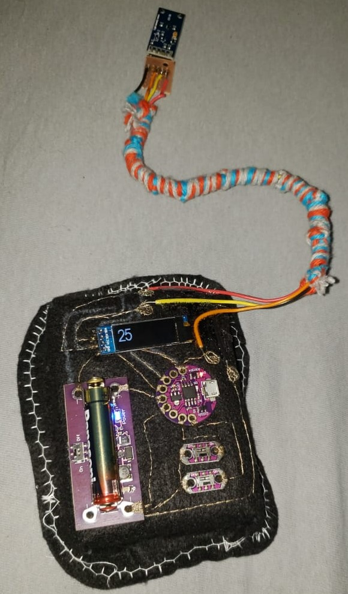
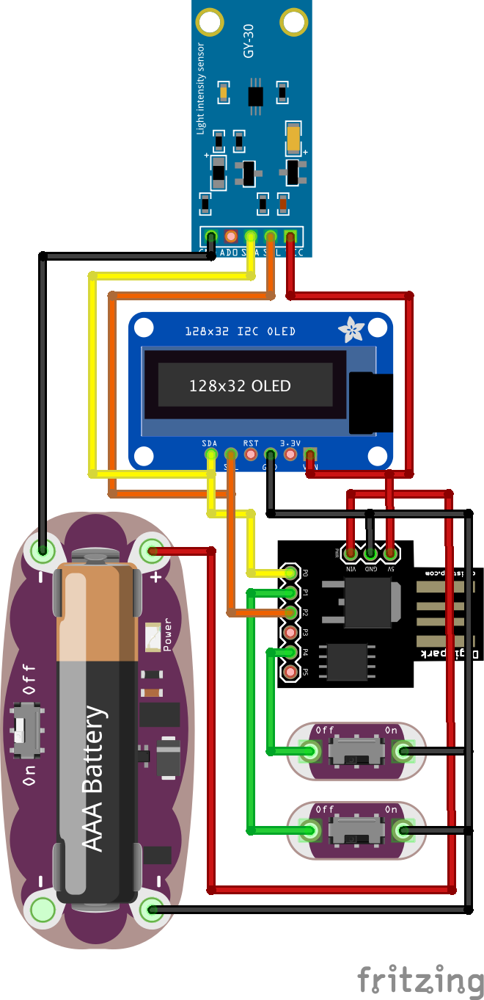

# Luximetro Vestível Lilytiny85
Luximetro digital feito para a placa vestível Lilytiny85 usando sensor de luminosidade GY30, módulo de pilha vestível e display OLED 0.91". 

Quase todo circuito feito com linha condutível, com exceção do fio que conecta o sensor de luminosidade, onde foi usado fio rígido para dar mais maleabilidade a invenção.

Inspirado na arma de portais do Rick.

